Hands-on Downstream Analysis of Protein Level Data
================

## Notebook Setup

**Check and Install if Necessary**

``` r
if (!requireNamespace("protti", quietly = TRUE))
    install.packages("protti")
if (!requireNamespace("tidyverse", quietly = TRUE))
    install.packages("tidyverse")
if (!requireNamespace("pheatmap", quietly = TRUE))
    install.packages("pheatmap")
if (!requireNamespace("seriation", quietly = TRUE))
    install.packages("seriation")
if (!requireNamespace("dendextend", quietly = TRUE))
    install.packages("dendextend")
if (!requireNamespace("gprofiler2", quietly = TRUE))
    install.packages("gprofiler2")
if (!requireNamespace("limma", quietly = TRUE)) {
    if (!requireNamespace("BiocManager", quietly = TRUE)) {
        install.packages("BiocManager")
    }
    BiocManager::install("limma")
}
```

**Load Packages Necessary**

``` r
library(limma) # for stat-test
library(protti) # for QC and process
library(tidyverse) # data manipulation & visual
library(gprofiler2) # Enrichment of protein sets
source("utils.R")  # Custom functions
```

**Load Data**

``` r
# Load Metadata
metadata <- read_csv("data/meta_data.csv")
```

    ## Rows: 72 Columns: 6
    ## ── Column specification ────────────────────────────────────────────────────────
    ## Delimiter: ","
    ## chr (5): ID, SampleType, Disease, Stage, SampleName
    ## dbl (1): Replica
    ## 
    ## ℹ Use `spec()` to retrieve the full column specification for this data.
    ## ℹ Specify the column types or set `show_col_types = FALSE` to quiet this message.

``` r
# Load Protein Data
protein_data <- read_csv("data/protein_data.csv")
```

    ## Rows: 6396 Columns: 73
    ## ── Column specification ────────────────────────────────────────────────────────
    ## Delimiter: ","
    ## chr  (1): PG.ProteinAccessions
    ## dbl (72): NP01_1, NP01_2, NP02_1, NP02_2, NP27_1, NP27_2, NP35_1, NP35_2, NP...
    ## 
    ## ℹ Use `spec()` to retrieve the full column specification for this data.
    ## ℹ Specify the column types or set `show_col_types = FALSE` to quiet this message.

``` r
# Convert the peptide_data to long format
protein_data_long <- tidyr::pivot_longer(
    protein_data,
    cols = -c("PG.ProteinAccessions"),
    names_to = "ID",
    values_to = "Intensity"
)
```

``` r
# Merge the metadata and peptide_data_longer
protein_data_long <- dplyr::left_join(
    protein_data_long,
    metadata,
    by = "ID"
)
```

``` r
# Rename the columns
protein_data_long <- dplyr::rename(
    protein_data_long,
    "Protein" = "PG.ProteinAccessions",
    "Sample" = "ID"
)
```

``` r
# Create a log2 transformed intensity column
protein_data_long$Intensity_log2 <- log2(protein_data_long$Intensity)
```

``` r
plot <- qc_ids(
    data = protein_data_long,
    sample = SampleName,
    grouping = Protein,
    condition = SampleType,
    intensity = Intensity,
    plot = TRUE
)
plot
```

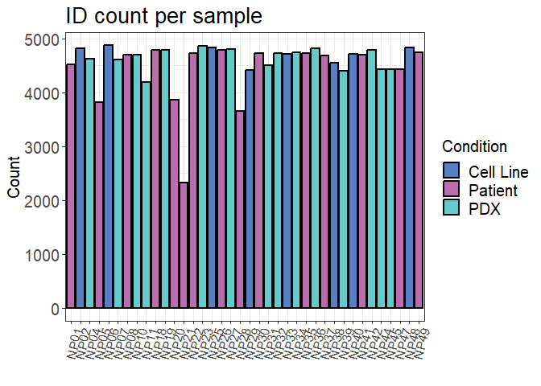<!-- -->

``` r
#   a. Intensity Distribution
qc_intensity_distribution(
    data = protein_data_long,
    sample = SampleName,
    grouping = Protein,
    intensity_log2 = Intensity_log2,
    plot_style = "boxplot"
)
```

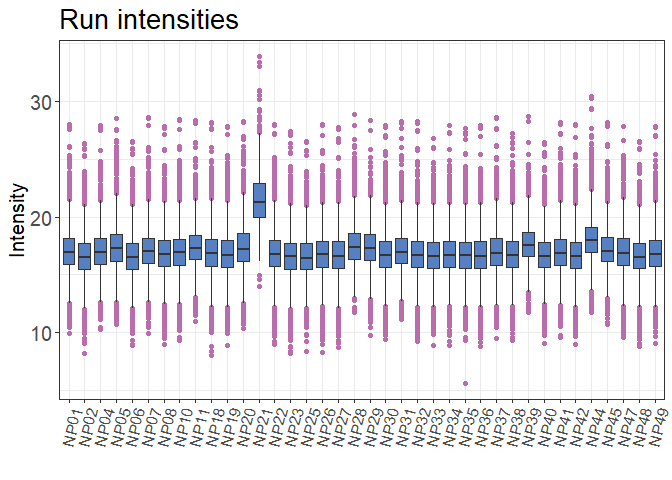<!-- -->

``` r
#   b. Median Intensity Plot
qc_median_intensities(
    data = protein_data_long,
    sample = SampleName,
    grouping = Protein,
    intensity = Intensity_log2
)
```

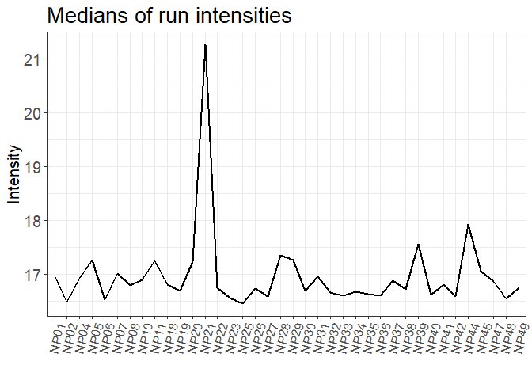<!-- -->

``` r
qc_cvs(
    data = protein_data_long,
    grouping = Protein,
    condition = SampleType,
    intensity = Intensity,
    plot = TRUE,
    plot_style = "boxplot"
)
```

    ## Warning in qc_cvs(data = protein_data_long, grouping = Protein, condition =
    ## SampleType, : 1166 values were exluded from the plot (CV > 200 %)

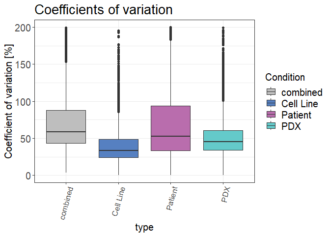<!-- -->

``` r
protein_data_long$SampleType_Disease <- paste(
    protein_data_long$SampleType,
    protein_data_long$Disease,
    sep = "_"
)
qc_cvs(
    data = protein_data_long,
    grouping = Protein,
    condition = SampleType_Disease,
    intensity = Intensity,
    plot = TRUE,
    plot_style = "boxplot"
)
```

    ## Warning in qc_cvs(data = protein_data_long, grouping = Protein, condition =
    ## SampleType_Disease, : 613 values were exluded from the plot (CV > 200 %)

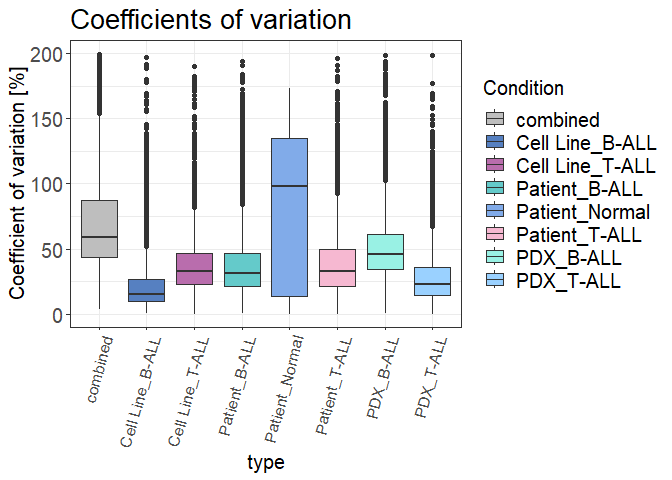<!-- -->

``` r
qc_data_completeness(
    data = protein_data_long,
    sample = Sample,
    grouping = Protein,
    intensity = Intensity_log2,
    plot = TRUE
)
```

<!-- -->

``` r
qc_sample_correlation(
    data = protein_data_long,
    sample = Sample,
    grouping = Protein,
    intensity = Intensity_log2,
    condition = SampleType,
    interactive = FALSE,
    method = "pearson"
)
```

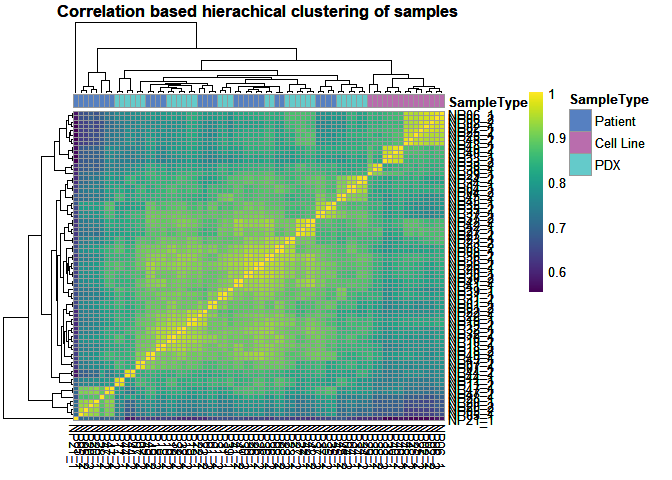<!-- -->

``` r
qc_pca(
  data = protein_data_long,
  sample = Sample,
  grouping = Protein,
  intensity = Intensity_log2,
  condition = SampleType,
  digestion = NULL,
  plot_style = "scree"
)
```

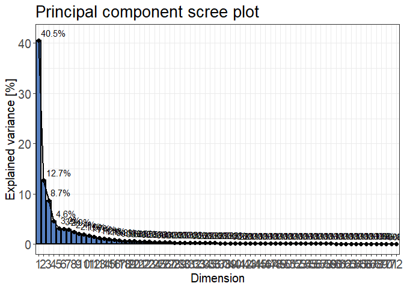<!-- -->

``` r
qc_pca(
  data = protein_data_long,
  sample = Sample,
  grouping = Protein,
  intensity = Intensity_log2,
  condition = SampleType,
  digestion = NULL,
  plot_style = "pca"
)
```

    ## Warning: ggrepel: 57 unlabeled data points (too many overlaps). Consider
    ## increasing max.overlaps

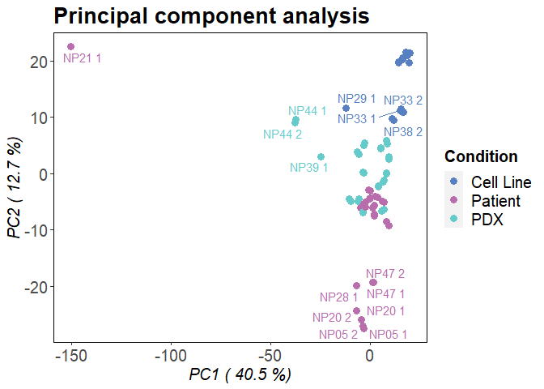<!-- -->

``` r
# 7. Ranked Intensity Distribution (Protein-Rank Plot)
qc_ranked_intensities(
  data = protein_data_long,
  sample = Sample,
  grouping = Protein,
  intensity_log2 = Intensity_log2,
  plot = TRUE,
  y_axis_transformation = "log2"
)
```

    ## Warning: ggrepel: 15 unlabeled data points (too many overlaps). Consider
    ## increasing max.overlaps

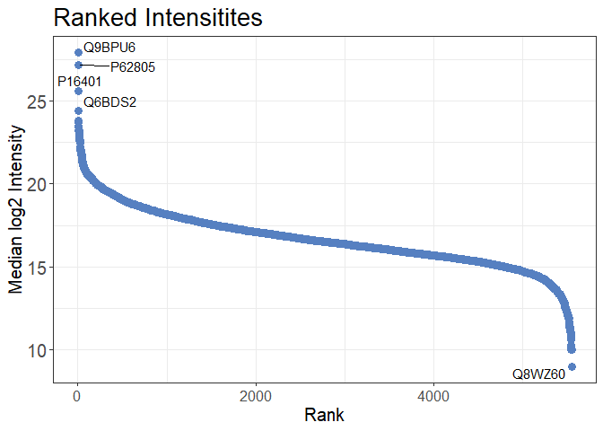<!-- -->

``` r
protein_data_long <- dplyr::filter(
    protein_data_long,
    SampleName != "NP21"
)

qc_pca(
  data = protein_data_long,
  sample = Sample,
  grouping = Protein,
  intensity = Intensity_log2,
  condition = SampleType,
  digestion = NULL,
  plot_style = "pca"
)
```

    ## Warning: ggrepel: 50 unlabeled data points (too many overlaps). Consider
    ## increasing max.overlaps

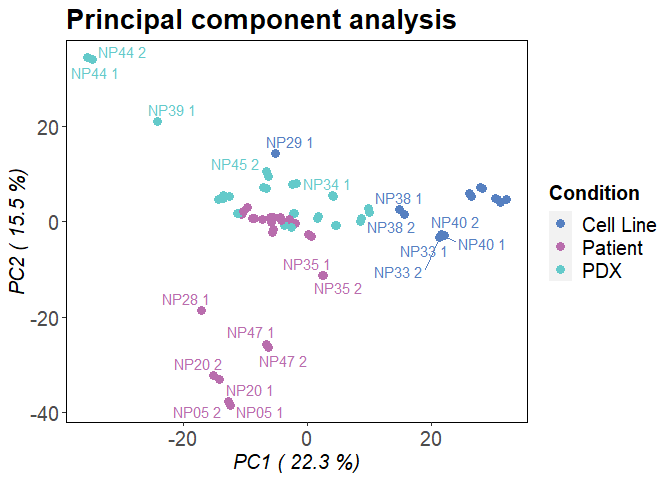<!-- -->

``` r
protein_data_long <- normalise(
    data = protein_data_long,
    sample = Sample,
    intensity = Intensity_log2,
    method = "median"
)

# Plot again with log2 transformed intensity
qc_intensity_distribution(
    data = protein_data_long,
    sample = SampleName,
    grouping = Protein,
    intensity_log2 = normalised_intensity_log2,
    plot_style = "boxplot"
)
```

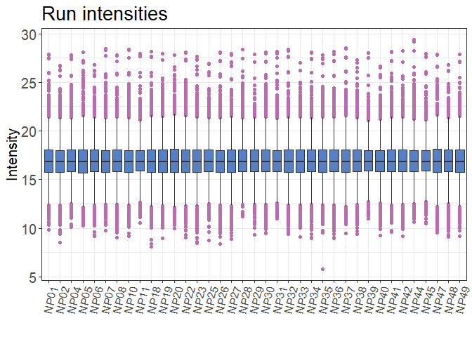<!-- -->

``` r
b1 <- qc_median_intensities(
    data = protein_data_long,
    sample = SampleName,
    grouping = Protein,
    intensity = Intensity_log2
) + ggplot2::ggtitle("Before Normalization")

b2 <- qc_median_intensities(
    data = protein_data_long,
    sample = SampleName,
    grouping = Protein,
    intensity = normalised_intensity_log2
) + ggplot2::ggtitle("After Normalization")

# Plot the two plots side-by-side
# TODO: Check if the cowplot package is installed on WIN11
# cowplot::plot_grid(
#     b1, b2,
#     ncol = 2
# )

b2
```

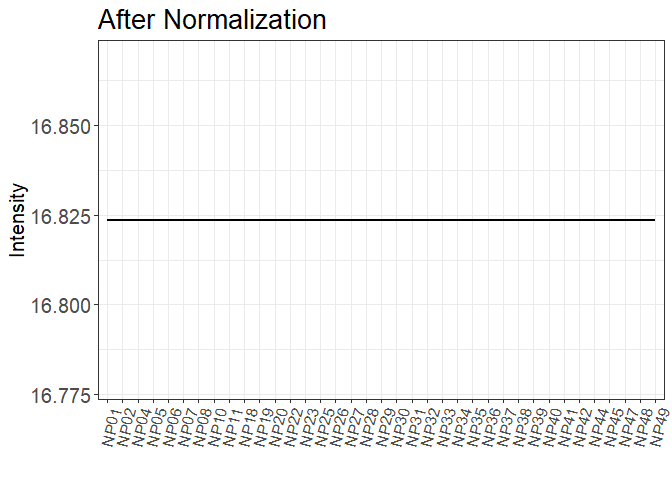<!-- -->

``` r
# Impute missing values
protein_data_long <- impute_with_downshifted_normal(
    data = protein_data_long,
    intensity_log2 = normalised_intensity_log2,
    prctl = 0.05,
    downshift_mag = 2.0,
    downshift_min = 0.1
)

qc_intensity_distribution(
    data = protein_data_long,
    sample = SampleName,
    grouping = Protein,
    intensity_log2 = normalised_intensity_log2,
    plot_style = "violin"
) + ggplot2::theme(
    axis.text.x = ggplot2::element_text(
        angle = 90,
        hjust = 1
    )
) + ggplot2::ggtitle(
    "Non-Imputed Intensity Distribution"
)
```

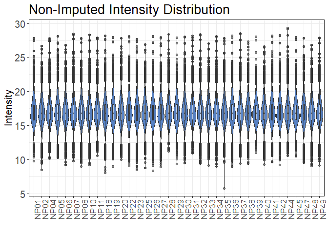<!-- -->

``` r
qc_intensity_distribution(
    data = protein_data_long,
    sample = SampleName,
    grouping = Protein,
    intensity_log2 = imputed_intensity_log2,
    plot_style = "violin"
) + ggplot2::theme(
    axis.text.x = ggplot2::element_text(
        angle = 90,
        hjust = 1
    )
) + ggplot2::ggtitle(
    "Imputed Intensity Distribution"
)
```

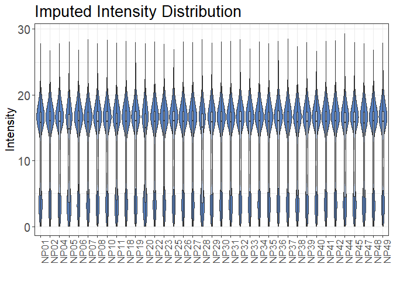<!-- -->

``` r
protein_data_wide <- protein_data_long %>%
    dplyr::select(
        Sample,
        Protein,
        imputed_intensity_log2
    ) %>%
    tidyr::pivot_wider(
        names_from = Sample,
        values_from = imputed_intensity_log2
    ) %>%
    tibble::column_to_rownames(
        var = "Protein"
    )
protein_data_wide_non_imputed <- protein_data_long %>%
    dplyr::select(
        Sample,
        Protein,
        normalised_intensity_log2
    ) %>%
    tidyr::pivot_wider(
        names_from = Sample,
        values_from = normalised_intensity_log2
    ) %>%
    tibble::column_to_rownames(
        var = "Protein"
    )
```

``` r
# Find the indices of the missing values
na_index <- which(is.na(protein_data_wide_non_imputed))

# Initialize the weight matrix
weight_matrix <- matrix(
    data = 1,
    nrow = nrow(protein_data_wide),
    ncol = ncol(protein_data_wide)
)
# Weighting of Missing Values
na_weight <- 0.00001
# Replace the missing values with the na_weight
weight_matrix[na_index] <- na_weight
```

``` r
# Create the design matrix
cur_meta <- as.data.frame(metadata)
rownames(cur_meta) <- cur_meta$ID
cur_meta <- cur_meta[
    which(
        rownames(cur_meta) %in% colnames(protein_data_wide)
    ),
]
# Make sure the columns are in the same order
design_matrix <- model.matrix(
    ~ cur_meta[, "Disease"]
)
```

``` r
# Variables
pval_thr <- 0.05
log2_fc_thr <- 1.0

# Fit a linear model with weights
fit <- limma::lmFit(
    protein_data_wide,
    design = design_matrix,
    weights = weight_matrix
)
# Run the model
fit_eb <- limma::eBayes(fit)
# Get the log2 fold changes
log2_fc <- fit_eb$coefficients[, 2]
# Get the average intensities
average <- fit_eb$Amean
# Get the pvalues
pvalues <- fit_eb$p.value[, 2]
# Get the adjusted pvalues
adj_pvalues <- p.adjust(
    pvalues,
    method = "fdr"
)

stat_res_df <- data.frame(
    Protein = rownames(protein_data_wide),
    log2_fc = log2_fc,
    average = average,
    pvalues = pvalues,
    adj_pvalues = adj_pvalues
)

# Initialize significance column with no significance
stat_res_df$significance <- "no significance"
# Find Up and Down regulated proteins
stat_res_df$significance[
    (stat_res_df$adj_pvalues < pval_thr) &
    (stat_res_df$log2_fc >= log2_fc_thr)
] <- "Up regulated"
stat_res_df$significance[
    (stat_res_df$adj_pvalues < pval_thr) &
    (stat_res_df$log2_fc <= -log2_fc_thr)
] <- "Down regulated"
# Make the significance column a factor column
stat_res_df$significance <- as.factor(stat_res_df$significance)
```

``` r
ggplot2::ggplot(
        stat_res_df,
        ggplot2::aes(
            x = log2_fc,
            y = -log10(adj_pvalues),
            color = significance,
            alpha = significance
        )
    ) +
    ggplot2::geom_point(size = 2) +
    ggplot2::geom_vline(
        xintercept = log2_fc_thr,
        linetype = "dashed",
        color = "darkgrey"
    ) +
    ggplot2::geom_vline(
        xintercept = -log2_fc_thr,
        linetype = "dashed",
        color = "darkgrey"
    ) +
    ggplot2::geom_hline(
        yintercept = -log10(pval_thr),
        linetype = "dashed",
        color = "darkgrey"
    ) +
    ggplot2::scale_color_manual(
        values = c(
            "Up regulated" = "#e63946",
            "Down regulated" = "#1d3557",
            "no significance" = "#b1a7a6"
        )
    ) +
    ggplot2::scale_alpha_manual(
        values = c(
            "Up regulated" = 1.0,
            "Down regulated" = 1.0,
            "no significance" = 0.2
        )
    ) +
    ggplot2::ggtitle("") +
    ggplot2::labs(
        x = "log2(Fold-Change)",
        y = "-log10(adjusted p-value)"
    )
```

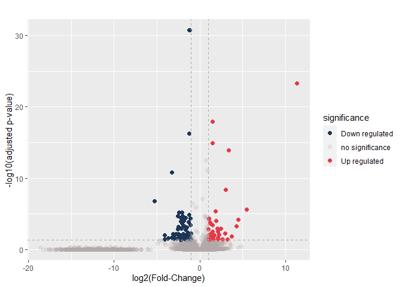<!-- -->

``` r
# Plot MA
ggplot2::ggplot(
        stat_res_df,
        ggplot2::aes(
            x = average,
            y = log2_fc,
            color = significance,
            alpha = significance
        )
    ) +
    ggplot2::geom_point(
        size = 3.5,
    ) +
    ggplot2::geom_hline(
        yintercept = log2_fc_thr,
        linetype = "dashed",
        color = "darkgrey"
    ) +
    ggplot2::geom_hline(
        yintercept = -log2_fc_thr,
        linetype = "dashed",
        color = "darkgrey"
    ) +
    # Draw a vertical line at the average intensity of 8
    ggplot2::geom_vline(
        xintercept = 8,
        linetype = "dashed",
        color = "#201717"
    ) +
    ggplot2::scale_color_manual(
        values = c(
            "Up regulated" = "#e63946",
            "Down regulated" = "#1d3557",
            "no significance" = "#b1a7a6"
        )
    ) +
    ggplot2::scale_alpha_manual(
        values = c(
            "Up regulated" = 1.0,
            "Down regulated" = 1.0,
            "no significance" = 0.2
        )
    ) +
    ggplot2::ggtitle("") +
    ggplot2::labs(
        x = "Average Intensity",
        y = "log2(Fold-Change)"
    )
```

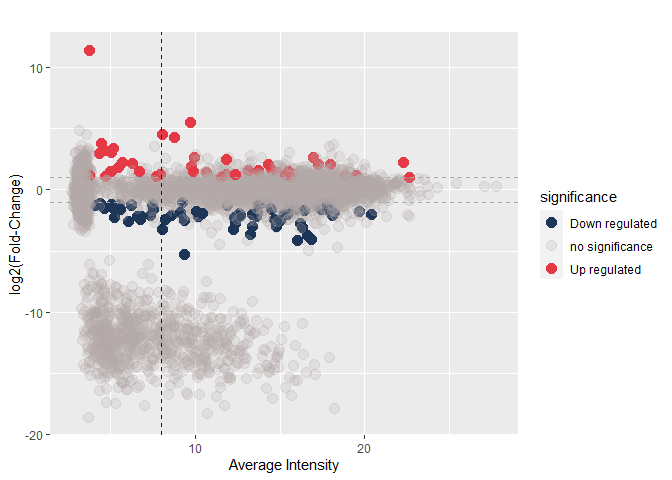<!-- -->

``` r
# Background is the list of all proteins
background <- rownames(protein_data_wide)
# Initilize the query list
go_list <- list()
# Add the list of up regulated proteins
go_list[["up_regulated"]] <- rownames(
    stat_res_df[
        which(
            stat_res_df$significance == "Up regulated"
        ),
    ]
)
# Add the list of down regulated proteins
go_list[["down_regulated"]] <- rownames(
    stat_res_df[
        which(
            stat_res_df$significance == "Down regulated"
        ),
    ]
)

# Run the enrichment analysis with gProfiler2
gostres <- gprofiler2::gost(
    query = go_list,
    organism = "hsapiens",  # Human
    user_threshold = 0.05,  # Enrichment p-value threshold
    custom_bg = background, # Custom Background
    domain_scope = "custom_annotated",
    sources = c(            # Source of annotations
        "GO:BP",
        "GO:MF",
        "GO:CC",
        "KEGG",
        "REAC"
        # "WP",
        # "HPA",
        # "CORUM",
        # "MIRNA",
        # "TF",
        # "HP"
    ),
    multi_query = FALSE,
    correction_method = "fdr",
)

# Calculate Gene Ratio
gostres$result$GeneRatio <- (
    gostres$result$intersection_size / gostres$result$term_size
)

gprofiler2::gostplot(
    gostres,
    capped = TRUE,
    interactive = FALSE,
)
```

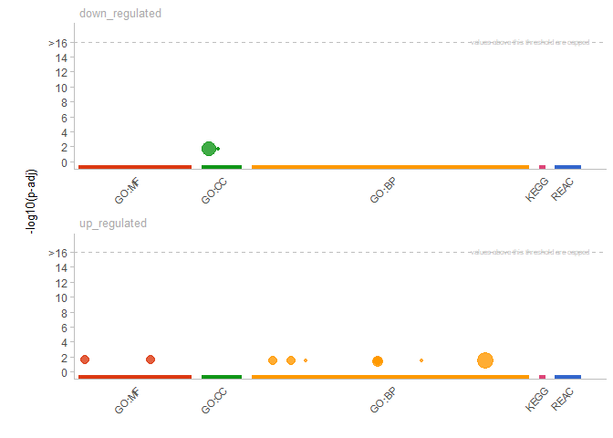<!-- -->
